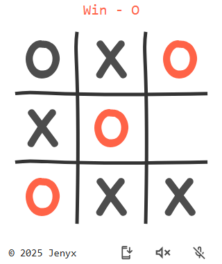

# Application Development Library

This library provides universal components for creating various applications in JavaScript, including games, interactive interfaces, and other web programs.

## Features

*   **PWA:** Progressive Web App support.
*   **Google Analytics:** Integration for tracking and analytics.
*   **Speech:** Text-to-speech and speech recognition.

## Performance

*   Gzipped full size of app (HTML + bundle.js + images) < 20 Kb

## Example Usage

As an example, a **Tic-Tac-Toe** game was created to demonstrate the capabilities of the library in action.

Visit the [live demo](https://jenyxjs.github.io/tic-tac-toe/www/app.html) to see it in action.

## Library Repository

Visit the [library repository](https://github.com/jenyxjs/jenyx) to learn more about the project, its documentation, and how to contribute.

## License

This project is licensed under the MIT License.